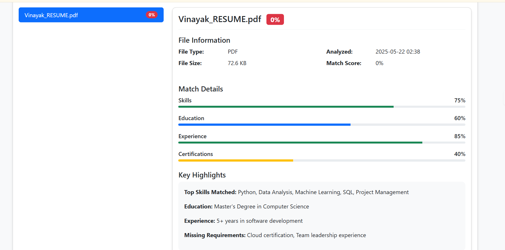
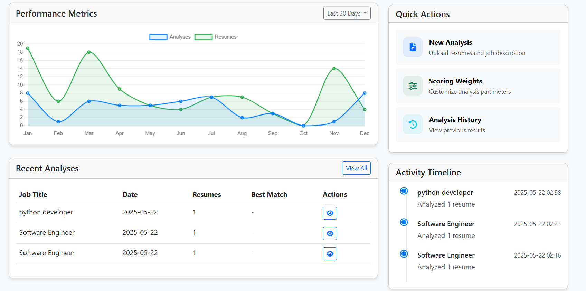
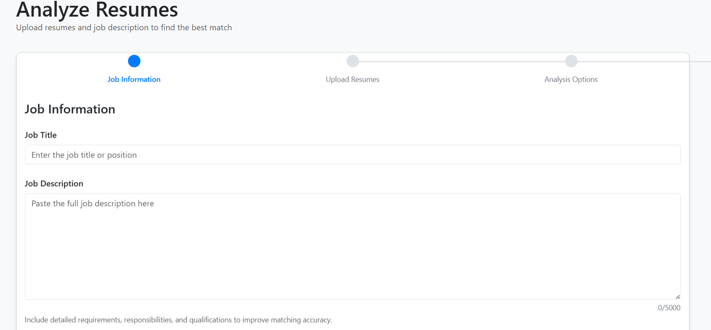

# Resume Analyzer

A sophisticated web application that uses AI algorithms to analyze resumes against job descriptions, providing intelligent matching and scoring capabilities.

## 🌟 Features

- **Intelligent Resume Analysis**: Matches resumes against job descriptions using advanced NLP algorithms
- **Multiple Format Support**: Handles PDF, DOCX, and TXT file formats
- **Customizable Scoring**: Configure weights for different aspects (skills, education, experience)
- **Detailed Analytics**: Visual representation of match scores with interactive charts
- **Multiple View Options**: Table, Card, and Detail views for results
- **Export Capabilities**: Export results in CSV and JSON formats
- **User Management**: Secure user authentication and profile management

## 📸 Screenshots

### Analysis Dashboard


*The main dashboard provides an overview of your analysis statistics and recent activities, with intuitive navigation to all key features.*

### Analysis Results View


*Detailed analysis results showing match scores, keyword highlighting, and multiple viewing options for better insight into each resume.*

### Resume Upload Interface


*Clean and intuitive interface for uploading resumes and job descriptions, with support for multiple file formats.*

## 🚀 Installation

1. Clone the repository:
```bash
git clone https://github.com/yourusername/resumeAnalyzer.git
cd resumeAnalyzer
```

2. Create and activate a virtual environment:
```bash
python -m venv venv
source venv/bin/activate  # On Windows: venv\Scripts\activate
```

3. Install dependencies:
```bash
pip install -r requirements.txt
```

4. Set up NLTK data:
```bash
python -c "import nltk; nltk.download('punkt'); nltk.download('stopwords'); nltk.download('wordnet'); nltk.download('averaged_perceptron_tagger')"
```

5. Configure environment variables:
```bash
cp .env.example .env
# Edit .env with your configuration
```

## 💻 Usage

1. Start the development server:
```bash
python app.py
```

2. Access the application at: `http://localhost:5000`

3. Register an account and start analyzing resumes!

## 🛠️ Technologies Used

- **Backend**: Python, Flask
- **Frontend**: HTML5, CSS3, JavaScript
- **Database**: SQLite/PostgreSQL
- **NLP Processing**: NLTK, scikit-learn
- **Document Processing**: 
  - PyMuPDF (PDF processing)
  - python-docx (DOCX processing)
  - textract (Text extraction)

## 📊 Features in Detail

### Resume Analysis
- Advanced text extraction from multiple file formats
- Customizable scoring weights for different criteria
- Intelligent keyword matching and scoring
- Visual representation of match percentages

### User Management
- Secure user authentication
- Profile management
- Analysis history tracking
- Custom scoring weights per user

### Analytics & Reporting
- Detailed match analysis
- Visual charts and graphs
- Exportable reports
- Historical data tracking

## 🤝 Contributing

Contributions are welcome! Please feel free to submit a Pull Request.

1. Fork the repository
2. Create your feature branch (`git checkout -b feature/AmazingFeature`)
3. Commit your changes (`git commit -m 'Add some AmazingFeature'`)
4. Push to the branch (`git push origin feature/AmazingFeature`)
5. Open a Pull Request

## 📝 License

MIT License

Copyright (c) 2025 [Your Name]

Permission is hereby granted, free of charge, to any person obtaining a copy
of this software and associated documentation files (the "Software"), to deal
in the Software without restriction, including without limitation the rights
to use, copy, modify, merge, publish, distribute, sublicense, and/or sell
copies of the Software, and to permit persons to whom the Software is
furnished to do so, subject to the following conditions:

The above copyright notice and this permission notice shall be included in all
copies or substantial portions of the Software.

THE SOFTWARE IS PROVIDED "AS IS", WITHOUT WARRANTY OF ANY KIND, EXPRESS OR
IMPLIED, INCLUDING BUT NOT LIMITED TO THE WARRANTIES OF MERCHANTABILITY,
FITNESS FOR A PARTICULAR PURPOSE AND NONINFRINGEMENT. IN NO EVENT SHALL THE
AUTHORS OR COPYRIGHT HOLDERS BE LIABLE FOR ANY CLAIM, DAMAGES OR OTHER
LIABILITY, WHETHER IN AN ACTION OF CONTRACT, TORT OR OTHERWISE, ARISING FROM,
OUT OF OR IN CONNECTION WITH THE SOFTWARE OR THE USE OR OTHER DEALINGS IN THE
SOFTWARE.

## 📧 Contact

Your Name - [@yourtwitter](https://twitter.com/yourtwitter) - email@example.com

Project Link: [https://github.com/yourusername/resumeAnalyzer](https://github.com/yourusername/resumeAnalyzer)

# Resume Analyzer

A sophisticated web application that uses AI algorithms to analyze resumes against job descriptions, providing intelligent matching and scoring capabilities.

## 🌟 Features

- **Intelligent Resume Analysis**: Matches resumes against job descriptions using advanced NLP algorithms
- **Multiple Format Support**: Handles PDF, DOCX, and TXT file formats
- **Customizable Scoring**: Configure weights for different aspects (skills, education, experience)
- **Detailed Analytics**: Visual representation of match scores with interactive charts
- **Multiple View Options**: Table, Card, and Detail views for results
- **Export Capabilities**: Export results in CSV and JSON formats
- **User Management**: Secure user authentication and profile management

## 📸 Screenshots

### Resume Analysis Dashboard

*Main dashboard showing analysis statistics and recent activities*

### Analysis Results

*Detailed analysis results with match scoring*

### Upload Interface

*Clean and intuitive resume upload interface*

## 🚀 Installation

1. Clone the repository:
```bash
git clone https://github.com/vara910/resumeAnalyzer.git
cd resumeAnalyzer
```

2. Create and activate a virtual environment:
```bash
python -m venv venv
source venv/bin/activate  # On Windows: venv\Scripts\activate
```

3. Install dependencies:
```bash
pip install -r requirements.txt
```

4. Set up NLTK data:
```bash
python -c "import nltk; nltk.download('punkt'); nltk.download('stopwords'); nltk.download('wordnet'); nltk.download('averaged_perceptron_tagger')"
```

5. Configure environment variables:
```bash
cp .env.example .env
# Edit .env with your configuration
```

## 💻 Usage

1. Start the development server:
```bash
python app.py
```

2. Access the application at: `http://localhost:5000`

3. Register an account and start analyzing resumes!

## 🛠️ Technologies Used

- **Backend**: Python, Flask
- **Frontend**: HTML5, CSS3, JavaScript
- **Database**: SQLite/PostgreSQL
- **NLP Processing**: NLTK, scikit-learn
- **Document Processing**: 
  - PyMuPDF (PDF processing)
  - python-docx (DOCX processing)
  - textract (Text extraction)

## 📊 Features in Detail

### Resume Analysis
- Advanced text extraction from multiple file formats
- Customizable scoring weights for different criteria
- Intelligent keyword matching and scoring
- Visual representation of match percentages

### User Management
- Secure user authentication
- Profile management
- Analysis history tracking
- Custom scoring weights per user

### Analytics & Reporting
- Detailed match analysis
- Visual charts and graphs
- Exportable reports
- Historical data tracking

## 🤝 Contributing

Contributions are welcome! Please feel free to submit a Pull Request.

1. Fork the repository
2. Create your feature branch (`git checkout -b feature/AmazingFeature`)
3. Commit your changes (`git commit -m 'Add some AmazingFeature'`)
4. Push to the branch (`git push origin feature/AmazingFeature`)
5. Open a Pull Request

## 📝 License

MIT License

Copyright (c) 2025 [Varaprasad]

Permission is hereby granted, free of charge, to any person obtaining a copy
of this software and associated documentation files (the "Software"), to deal
in the Software without restriction, including without limitation the rights
to use, copy, modify, merge, publish, distribute, sublicense, and/or sell
copies of the Software, and to permit persons to whom the Software is
furnished to do so, subject to the following conditions:

The above copyright notice and this permission notice shall be included in all
copies or substantial portions of the Software.

THE SOFTWARE IS PROVIDED "AS IS", WITHOUT WARRANTY OF ANY KIND, EXPRESS OR
IMPLIED, INCLUDING BUT NOT LIMITED TO THE WARRANTIES OF MERCHANTABILITY,
FITNESS FOR A PARTICULAR PURPOSE AND NONINFRINGEMENT. IN NO EVENT SHALL THE
AUTHORS OR COPYRIGHT HOLDERS BE LIABLE FOR ANY CLAIM, DAMAGES OR OTHER
LIABILITY, WHETHER IN AN ACTION OF CONTRACT, TORT OR OTHERWISE, ARISING FROM,
OUT OF OR IN CONNECTION WITH THE SOFTWARE OR THE USE OR OTHER DEALINGS IN THE
SOFTWARE.

## 📧 Contact

Your Name - [@yourtwitter](https://twitter.com/yourtwitter) - email@example.com

Project Link: [https://github.com/vara910/resumeAnalyzer](https://github.com/vara910/resumeAnalyzer)

# Resume Analyzer

A powerful tool that uses natural language processing and machine learning to analyze resumes against job descriptions, helping recruiters find the best candidates for their positions.

[](https://www.python.org/)
[](https://flask.palletsprojects.com/)
[](https://getbootstrap.com/)
[](LICENSE)


## 🚀 Quick Start

```bash
# Clone the repository
git clone https://github.com/vara910/ResumeAnalyzer.git
cd ResumeAnalyzer

# Install dependencies
pip install -r requirements.txt

# Initialize the application (creates database, admin user, and directory structure)
python init.py

# Run the application
python app.py
```

Then open your browser and navigate to [http://localhost:5000](http://localhost:5000)

## 📋 Features

- **Resume Analysis**: Compare multiple resumes against job descriptions to find the best match
- **Custom Scoring Weights**: Set your own weights for skills, education, experience, and certifications
- **Multiple File Formats**: Support for PDF, DOCX, DOC, and TXT resume formats
- **Visual Results**: Interactive visualizations of matching scores and comparisons
- **User Authentication**: Secure account management with role-based access control
- **History Tracking**: Save and review previous analyses
- **Export Options**: Export results in CSV, JSON, or PDF formats
- **Responsive Design**: Works on desktop and mobile devices

## 📦 Installation

### Requirements

- Python 3.8 or higher
- pip (Python package installer)
- Virtual environment (recommended)

### Step-by-Step Installation

1. **Set up a virtual environment (recommended)**:
   ```bash
   python -m venv venv
   # On Windows
   venv\Scripts\activate
   # On macOS/Linux
   source venv/bin/activate
   ```

2. **Install dependencies**:
   ```bash
   pip install -r requirements.txt
   ```

3. **Initialize the application**:
   ```bash
   python init.py
   ```
   This will:
   - Create necessary directories
   - Set up the database
   - Create an admin user
   - Set up default scoring weights

4. **Run the application**:
   ```bash
   python app.py
   ```

## 🔧 Configuration

The application can be configured using environment variables or by editing the configuration section in the `app.py` file.

### Environment Variables

| Variable | Description | Default |
|----------|-------------|---------|
| `SECRET_KEY` | Secret key for session security | dev_key_replace_in_production |
| `SECURITY_PASSWORD_SALT` | Salt for password security | salt_replace_in_production |
| `MAIL_SERVER` | SMTP server for sending emails | smtp.example.com |
| `MAIL_PORT` | SMTP port | 587 |
| `MAIL_USE_TLS` | Use TLS for email | True |
| `MAIL_USERNAME` | SMTP username | user@example.com |
| `MAIL_PASSWORD` | SMTP password | password |
| `ADMIN_PASSWORD` | Default admin password | admin |
| `FLASK_DEBUG` | Run in debug mode | False |
| `FLASK_HOST` | Host to bind to | 0.0.0.0 |
| `FLASK_PORT` | Port to bind to | 5000 |

## 📖 Usage Examples

### Analyzing Resumes

1. Log in to your account
2. Click on "Analyze Resumes" in the navigation bar
3. Enter the job title and job description
4. Upload one or more resumes (PDF, DOCX, DOC, or TXT format)
5. Select scoring weights (or use the default)
6. Click "Analyze Resumes"
7. View the results showing the best matches

### Managing Scoring Weights

1. Navigate to "Scoring Weights" in the dashboard
2. Click "Create New Weights"
3. Set custom values for skills, education, experience, and certifications (must sum to 1.0)
4. Save your custom weights
5. Use them in future analyses

### Viewing Analysis History

1. Navigate to "Analysis History" in the dashboard
2. View all previous analyses with timestamps and job titles
3. Click on any analysis to view detailed results
4. Export results in various formats

## 🔍 How It Works

1. **Text Extraction**: The system extracts text from uploaded resume files
2. **Preprocessing**: Both the resume text and job description are preprocessed using NLP techniques
3. **Feature Extraction**: TF-IDF vectorization is used to extract features
4. **Similarity Calculation**: Cosine similarity is calculated between each resume and the job description
5. **Weighted Scoring**: Custom weights are applied to different aspects of the match
6. **Results Visualization**: Results are displayed with detailed breakdowns and visualizations

## 🧪 Development Setup

For developers who want to contribute or modify the application:

1. **Clone and set up the project as described in the installation section**

2. **Install development dependencies**:
   ```bash
   pip install -r requirements-dev.txt
   ```

3. **Run tests**:
   ```bash
   pytest
   ```

4. **Code style checks**:
   ```bash
   flake8
   ```

5. **Project structure**:
   ```
   ResumeAnalyzer/
   ├── app.py              # Main application file
   ├── models.py           # Database models
   ├── forms.py            # Form definitions
   ├── utils.py            # Utility functions
   ├── auth.py             # Authentication routes
   ├── init.py             # Initialization script
   ├── requirements.txt    # Dependencies
   ├── templates/          # HTML templates
   │   ├── base.html       # Base template
   │   ├── index.html      # Landing page
   │   ├── dashboard.html  # User dashboard
   │   ├── analyze.html    # Resume upload
   │   ├── results.html    # Analysis results
   │   ├── history.html    # Analysis history
   │   ├── weights.html    # Scoring weights
   │   ├── errors/         # Error pages
   │   └── auth/           # Authentication templates
   ├── uploads/            # Uploaded files (created at runtime)
   ├── logs/               # Log files (created at runtime)
   └── instance/           # Instance-specific data (created at runtime)
   ```

## 🤝 Contributing

Contributions are welcome! Please feel free to submit a Pull Request.

## 📜 License

This project is licensed under the MIT License - see the LICENSE file for details.

## 📞 Contact

If you have any questions or feedback, please open an issue on GitHub or contact the maintainer at example@example.com.

